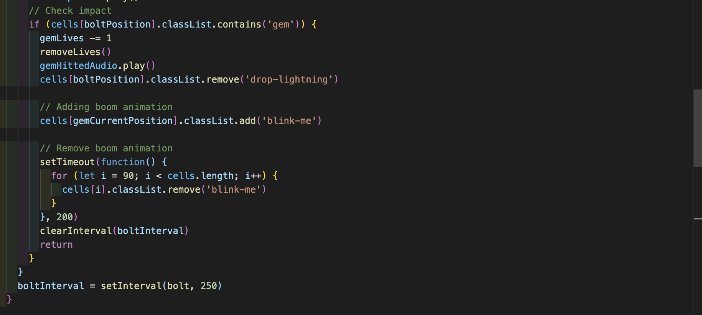
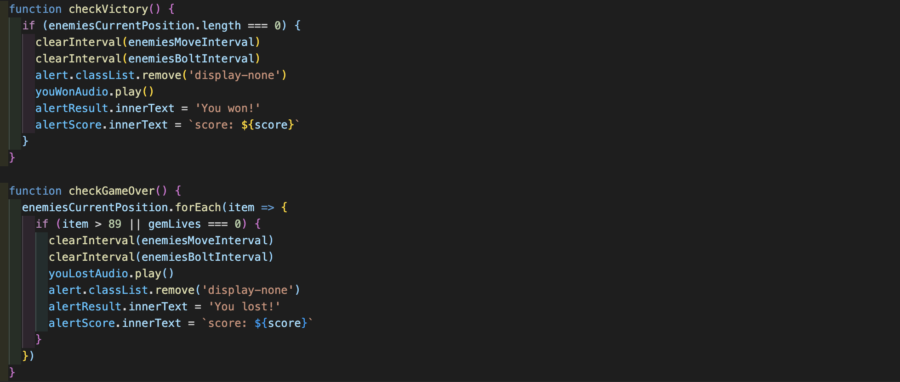
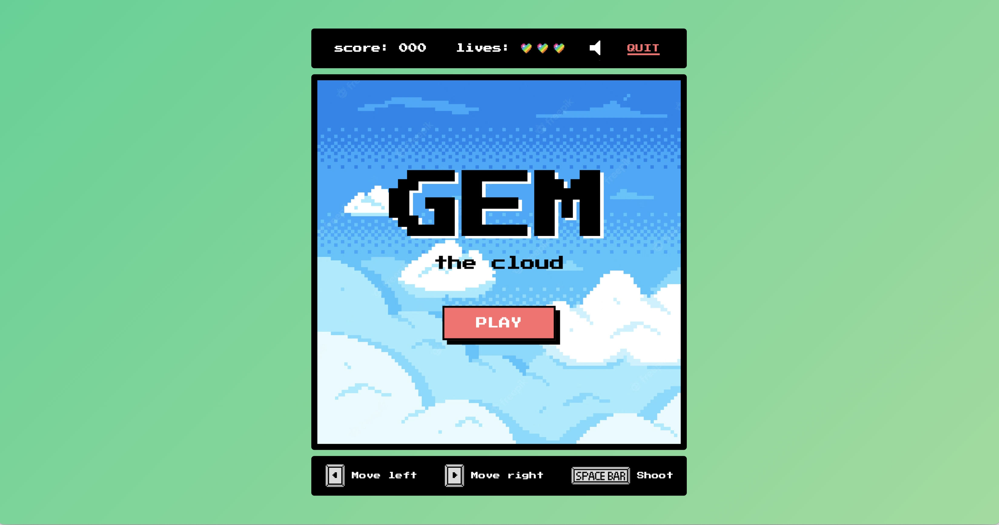

# 
# Gem, the cloud
## Riccardo Giubilo - Project 4 (1 week solo)

---
## Game's link
[Check out the game!](https://giubbas.github.io/GA-Project-1/)

## Brief
Gem the cloud is a reinterpretation of the Space Invaders arcade game. They both have a similar game logic. 

Gem is a cloud that likes good weather and doesn't want to be blown away by the storm. 
Help Gem clear the storm by hitting him with rainbow shots and be careful not to get hit by lightning!

---
## Technology used

### HTML
* **Basic structure composed by divs, buttons and headings**
* **Audio elements for background music and sound effects**

### CSS
* **Flex to arrange the elements**
* **Style the fonts**
* **Animate the "PLAY" button**

### JavaScript
* **Create the grid**
* **Hold the key and buttons events**
* **Write the functions that make the game work**

---
## The approach taken

I immediately made the basic structure of HTML and CSS and I generated the game grid in JavaScript. 

Then I moved on coding the game logic.
I first created Gem and enemies characters and gave them the possibility to move.

The image below shows how I implemented the enemies movement. Every time they reach the edge of the grid they go down a square and they change direction horizontally.

I made the Gem shots and I generated the lightning bolts by randomly selecting a shooter from the enemies that are still alive. 

So in the same function I checked if Gem was included in the missile's trajectory. If the impact occurred then I removed the bolt shot and added a "blink" class to Gem.

For the win and lose game logic I made a function in which the user wins if the enemies array is equal to 0 and another function in which the user lose if the enemies reach the ground or Gem's life is equal to 0.

Lastly I did the style with CSS and I drew the characters on pixilart.com. 
I wanted to give an old arcade style to the game so I made some pixel art graphics. 
I took the sound effects and the background music from the internet. 

---
## Wins

* **I managed to implement all the basic features I wanted plus the sound on/off button.**
* **I had enough time to do the style as I had imagined it and to draw some characters myself**

## Challenges

Building with JavaScript was quite challenging. Generating enemy movement and hits was the hardest thing, as I expected, but also the addition of various features, such as the "quit" and the "sound/sound-off" buttons and the possibility of being able to restart the game, proved to be tricky to implement. 

## Key learnings
* **Learned how to disabled buttons after they are clicked**
* **Learned how to use the setInterval()**
* **I got more familiar with the chrome inspector**
* **Learned how to track the character's positions and store it in a variable**

---

## Screens
### Start screen

### Game screen

## Potential future features
* **Add one or more levels of difficulty**
* **Make it responsive**

